# rhino_pizzeria

a fluter task for Rhino Software, Inc. Software company for flutter postion , that is an app for a truck that sells  pizza  , its use google oAuth with firebase and have 2 DBs one for users and the other for items 

## what do i use  for  building this project ?
 1. provider: ^6.0.0              for state mangement
 2. image_picker: ^0.8.4+2        for take the photos using android 
 3. http: ^0.13.3                 for requesting data
 4. firebase_core: ^1.6.0         to make connection with the firebase
 5. firebase_storage: ^10.0.3     for hosting images firebase
 6. location: ^4.2.0              to find the lat and long for maps
 7. google_sign_in: ^5.1.1        to set sign in with google 
 8. firebase_auth: ^3.1.2         to make one more layer for security
 9. font_awesome_flutter: ^9.1.0  to have google logo 
 
# Image as Admin

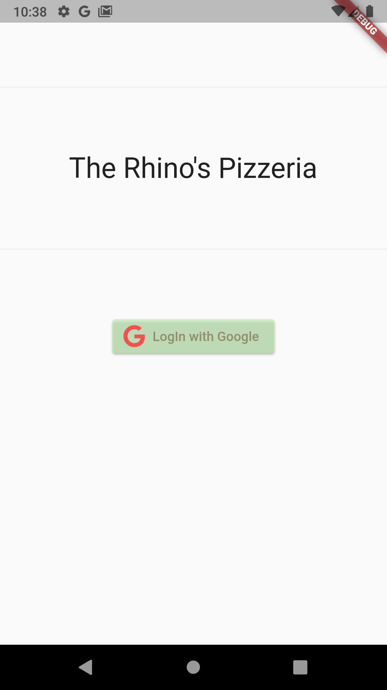
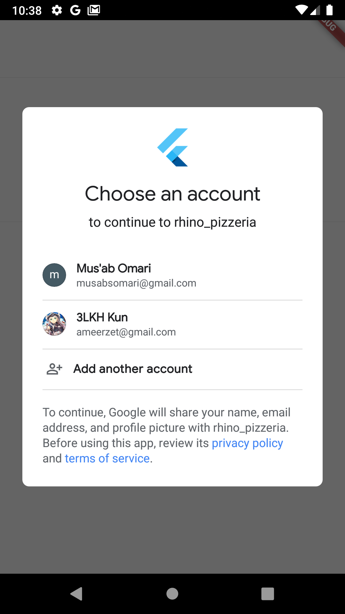
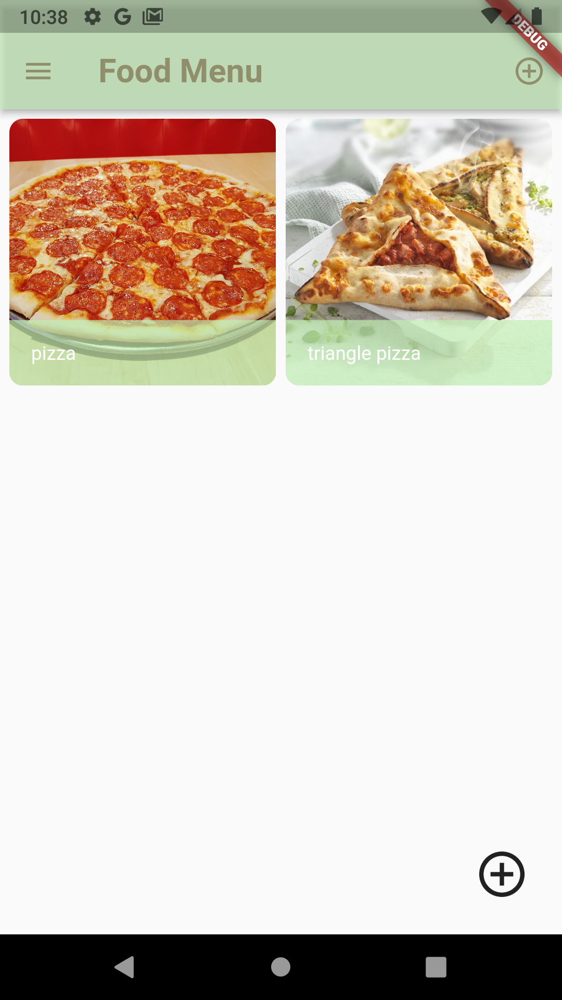
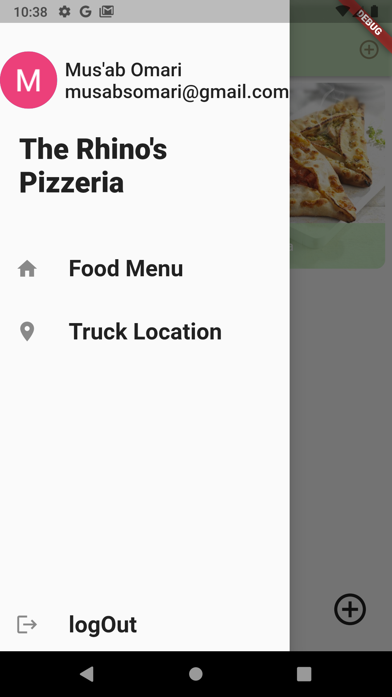

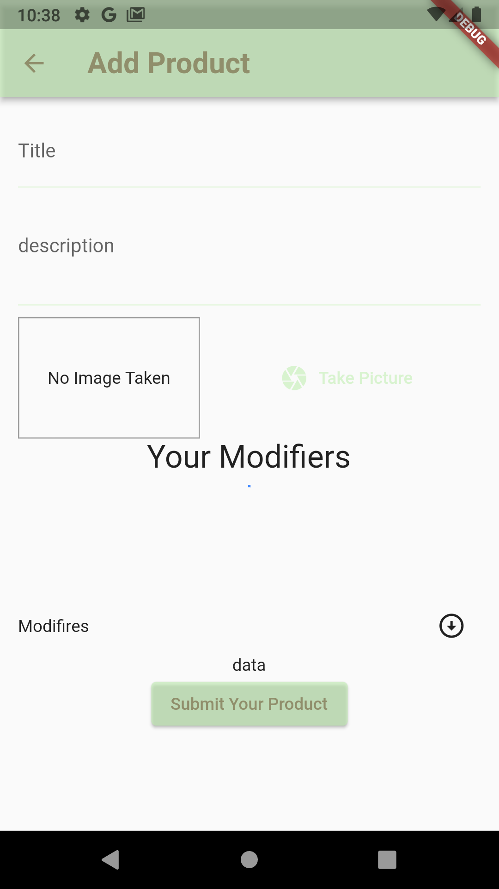

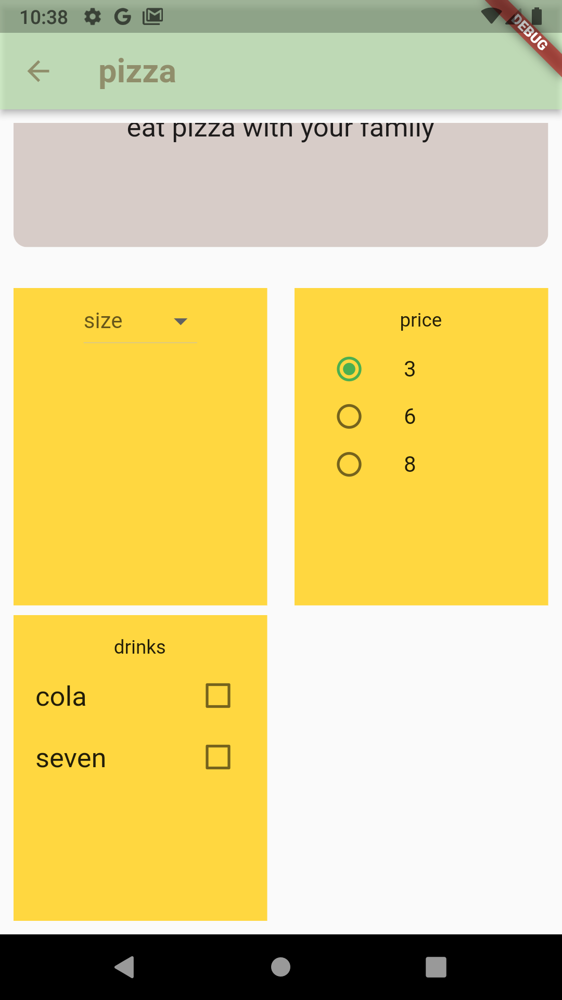
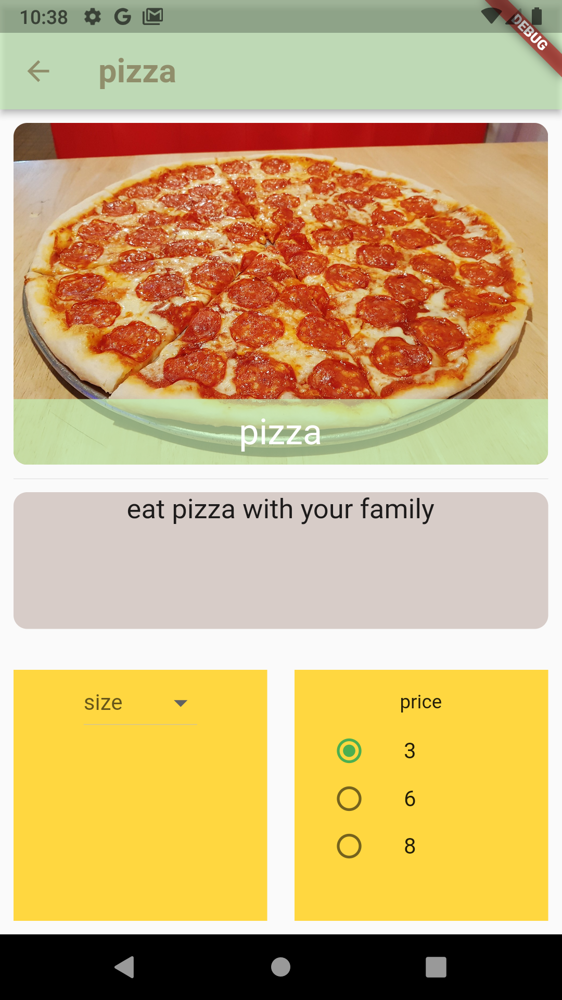

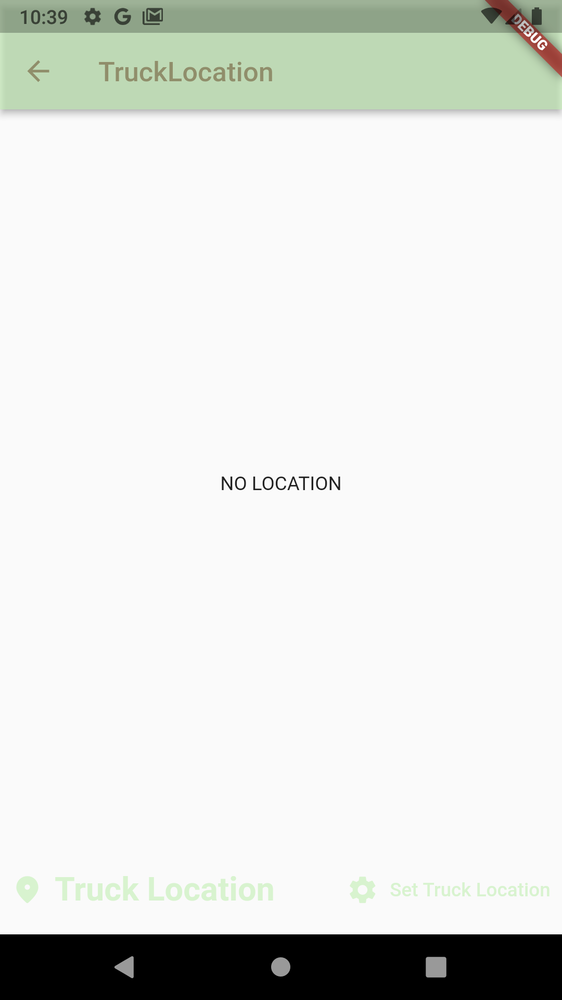

# Image as notAdmin

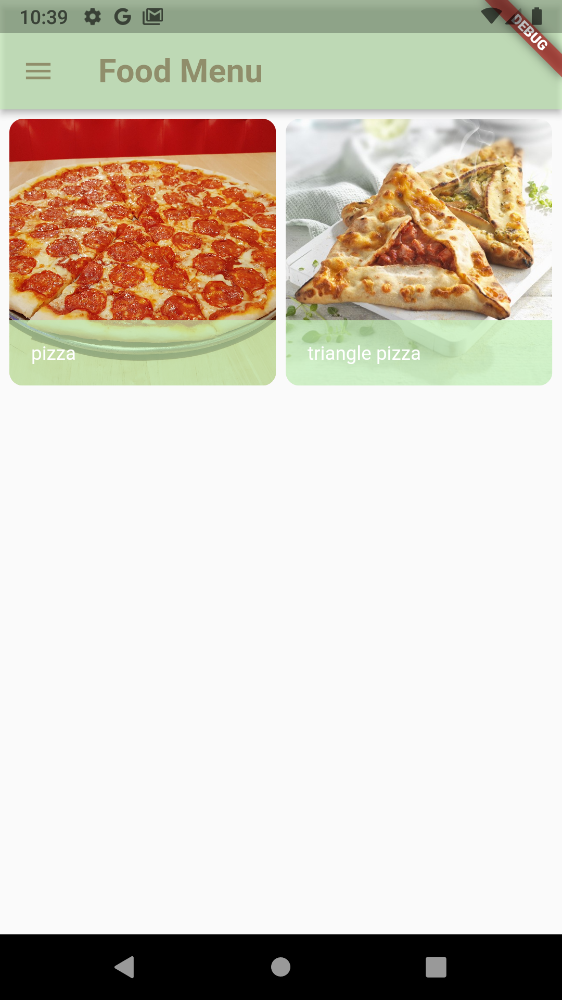
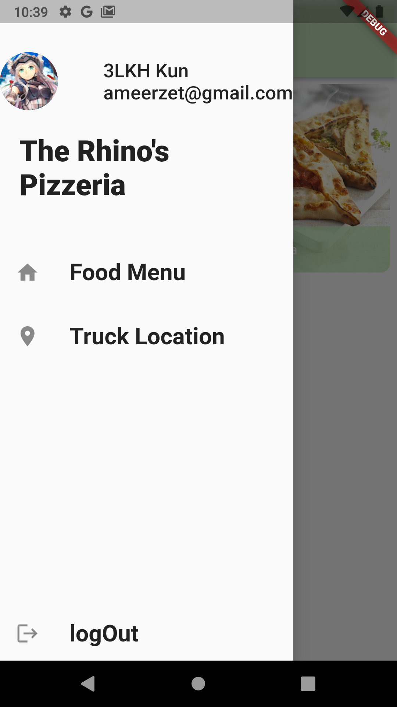
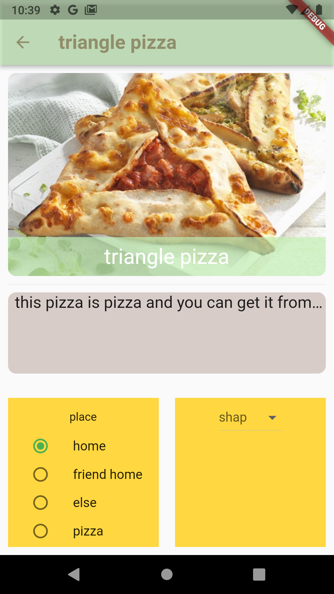
